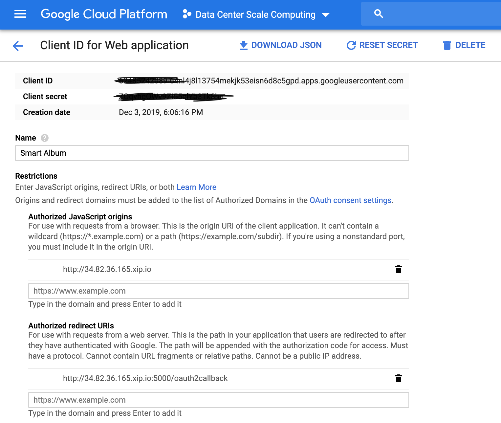
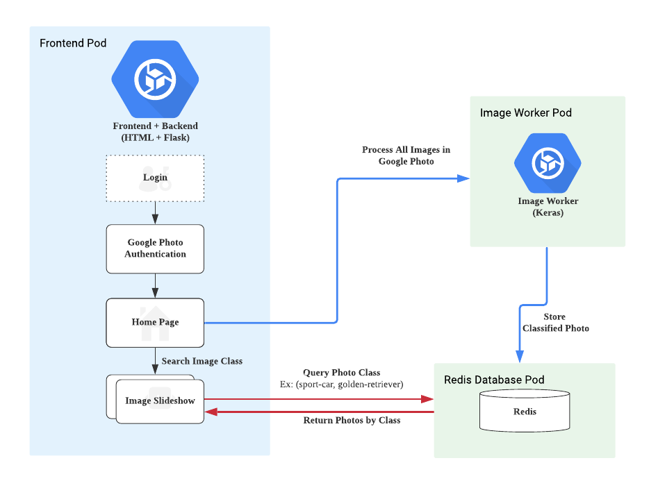

Smart Album
======
Smart Album is built on Google Cloud Platform, a service that can classify images in a given google photo account. After processing images, there will be a home page where user can query class name to find images slideshow of that class.
### Prerequisites:
1. Google Cloud Platform
2. Google Photo API
3. Kubernetes

### Steps:
1. Create GCP Computing Cluster: `> ./create_cluster.sh`
2. Create Image Worker base image: `> ./worker/create-base-images.sh` 
3. Create Image worker Deployment, Service, Horizontal Scaling: `> ./worker/create_worker.sh` 
4. Create Redis Deployment, Service: `> ./redis/redis-launch.sh`
5. Create Frontend Deployment, Service: `> ./frontend/frontend-launch.sh` 
6. Set Google Photo API: Replace **Authorized JavaScript origins** and **Authorized redirect URIs** with the external ip of your Frontend Service (*Run `> kubectl get services` to find it*)
After setting up Google Photo API, click **Download JSON** and store secret file under */frontend/auth* repository with the filename **client_secret.json**

1. Remove existing Frontend Deployment`> kubectl delete deployment rest-server` and Rerun step.5 command. (An error message saying the service is already created is expected. But we can totally ignore it!)

### Run:
Enter the external ip address plus 'xip.io:5000' Ex: http://34.82.36.165.xip.io:5000
The reason we requires xip.io is that we did not set DNS name for our service, yet Google Photo API requires a valid URI to work. Port 5000 is the default port used by FLASK.
### Demo Video Link:

### List of Software and Hardware Components:
1. Python
2. Keras (image processing model)
3. Flask REST server (/, /index, /authorize, /4. oauth2callback, /process_images)
5. gRPC
6. Redis (store the metadata of the JPEG)
7. Google Photos API
8. OAuth 2.0

### Architecture:

### Resources:

- [Keras pretrained VGG16 w/ imagenet](https://keras.io/applications/#vgg16)
- [W3.css Frontend Template](https://www.w3schools.com/w3css/w3css_templates.asp)